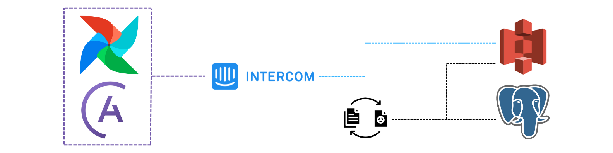

Repositório com Extração de dados via API
========

  

*1º Projeto API do Intercom:*

- Extrair dados do intercom via api;
- Fazer a requisição apenas dos dados que importam para o projeto;
- Fazer o upload desses dados em um S3 da AWS e um banco local SQL (postgre).

## Deploy feito local utilizando docker e astro cli (astronomer)

- Obs: O resultado com os dados reais não foram apresentados por questão de privacidade seguindo a LGPD.
- Obss: O objetivo principal foi treinar o uso de dags no airflow.

*Créditos ao professor [Neylson Crepalde](https://www.linkedin.com/in/neylsoncrepalde/)*